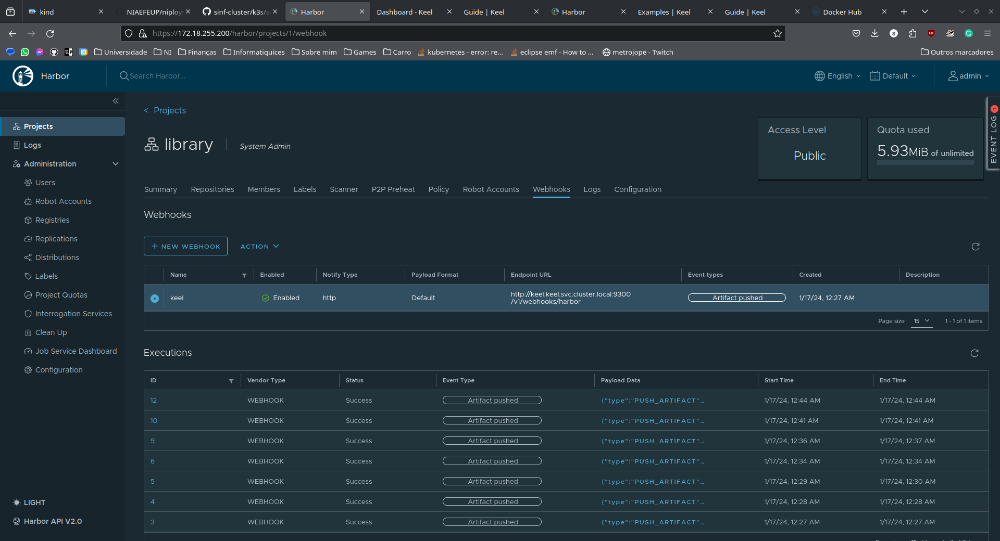
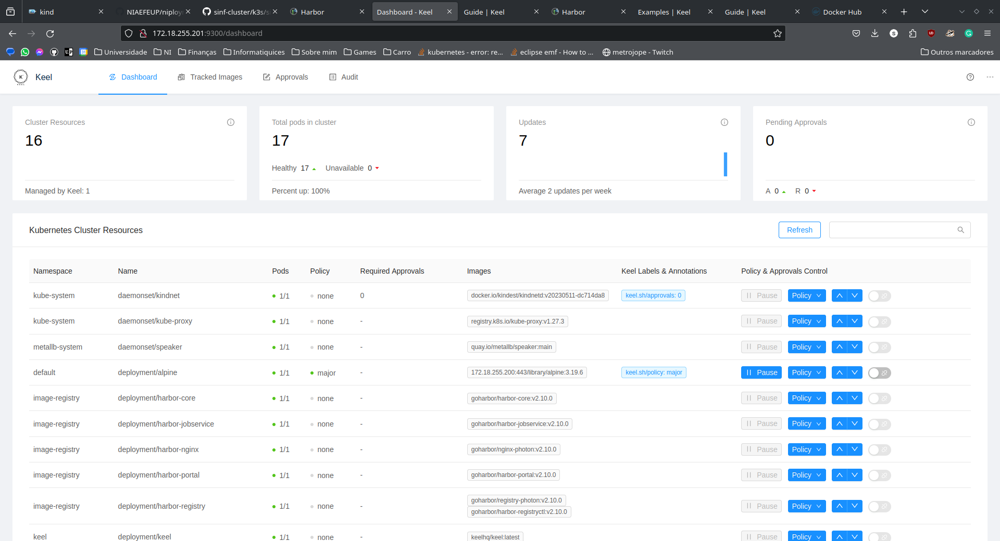

 
# Using Keel and Harbor for automated image deployment
Keel is an operator for tracking image updates and updating Kubernetes resources accordingly. Apart from polling and webhooks notifications for deployment updates (Deployments, StatefulSet, DaemonSet, Helm), it features an approval system through a Slack bot and update notifications integrated with some chat platforms.

It is a much simpler approach than using a full-fledged GitOps solution like [ArgoCD](https://argoproj.github.io/cd/) or [FluxCD](https://fluxcd.io/). We think the a full blow GitOps approach is overkill to our use case and might contribute negatively to the already accumulated technical debt.

> [!WARNING]  
> We assume that Harbor will take the first IP in the range `172.xxx.255.200` and that Keel will take the second `172.xxx.255.201`. Make sure to pay attention to places where this might be problematic (cluster config, mainly).

## Create the cluster using the config file provided
This config file allows the kubelet (running containerd) inside the containerised kind nodes to pull from registries with unverified TLS certificates. Check out more in this [StackOverflow post](https://stackoverflow.com/a/65116333).

```bash
kind create cluster --config image-registry-cd-test-cluster.kind.yaml
```

## Instal MetalLB
> [!IMPORTANT]
> Be sure to replace the xxx's in the template, chech [this page](https://kind.sigs.k8s.io/docs/user/loadbalancer/#setup-address-pool-used-by-loadbalancers) to get the correct subnet addresses.

```bash
kubectl apply -f https://github.com/metallb/metallb/raw/main/config/manifests/metallb-native.yaml

kubectl wait --namespace metallb-system \
                --for=condition=ready pod \
                --selector=app=metallb \
                --timeout=90s

echo "\
apiVersion: metallb.io/v1beta1
kind: IPAddressPool
metadata:
  name: example
  namespace: metallb-system
spec:
  addresses:
  - 172.18.255.200-172.18.255.250
---
apiVersion: metallb.io/v1beta1
kind: L2Advertisement
metadata:
  name: empty
  namespace: metallb-system" | \
kubectl apply -f -
```

## Deploy the [Harbor](https://goharbor.io/) image registry and [Keel](https://keel.sh)
### Prerequisites
- Helm

The following script installs Harbor using Helm charts and installs Keel with a Kubernetes manifest.

#### Harbor credentials
- username: admin
- password: Harbor12345

#### Keel credentials
- username: username
- password: password

```bash
chmod +x deploy.sh
./deploy.sh
```

## Create a deployment with Keel annotations for deployment configuration
> [!NOTE]
> Make sure to tag and push your images to Harbor before applying the deployment.

```bash 
docker pull alpine:3.16.3
docker login -u admin -p Harbor12345 172.xxx.255.200:443
docker tag alpine:3.16.3 172.xxx.255.200:443/library/alpine:3.16.3
docker tag alpine:3.16.3 172.xxx.255.200:443/library/alpine:3.16.4
docker tag alpine:3.16.3 172.xxx.255.200:443/library/alpine:3.16.5

docker push 172.xxx.255.200:443/library/alpine:3.16.3
```


Check the provided [example-deployment](./example-deployment.yaml).
More configurations are available in the [Keel documentation](https://keel.sh/docs/).

```bash
kubectl apply -f example-deployment.yaml
```

## Add a webhook in Harbor
In the project with your image add a webhook for artifact push events. Use the Fully Qualified Domain Name (FQDN) of the keel service and the correct endpoint for Harbor events. FQDNs follow the following pattern in Kubernetes `<service-name>.<namespace>.svc.<cluster-domain>`; usually, the cluster domain is `cluster.local`. It should look something like this:

> http://keel.keel.svc.cluster.local:9300/v1/webhooks/harbor



## Watch it all from the Keel dashboard
The Keel dashboard shows all the images it tracks and allows some on-the-fly modifications to update policies.

Run the following and watch the container version in the deployment change with it. You can do it through the dashboard or using `kubectl`.

```bash
docker push 172.xxx.255.200:443/library/alpine:3.16.4 # You can do it again with the 3.16.5 tag
kubectl describe deployemnt alpine # Check the iamge tag
```

